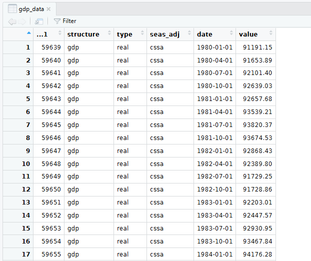
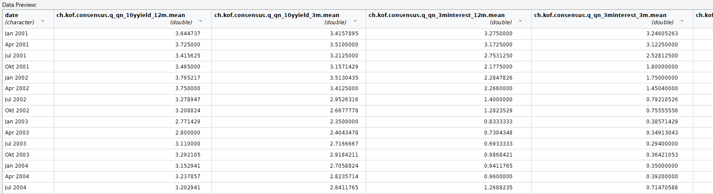
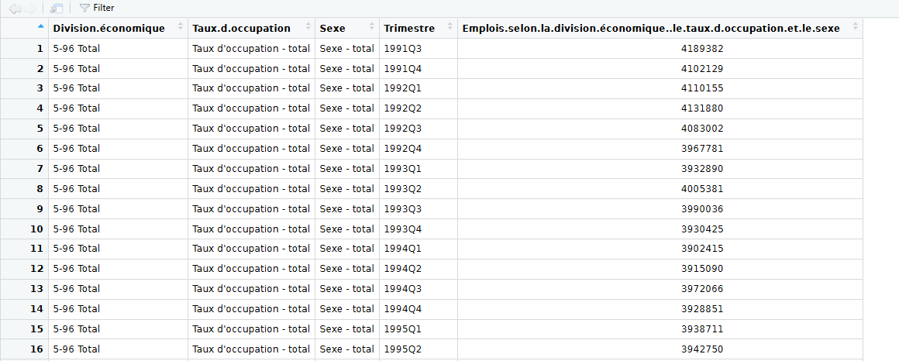
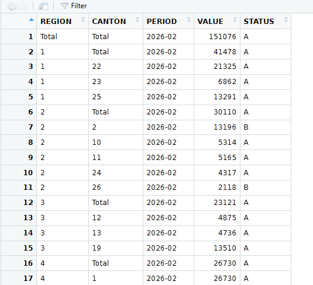
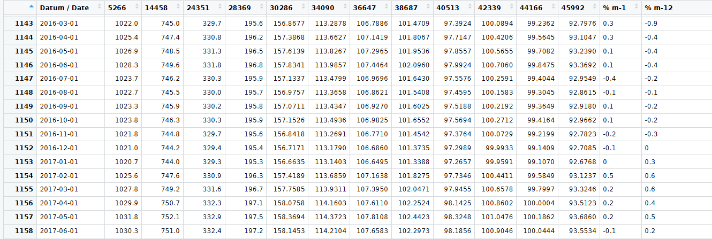
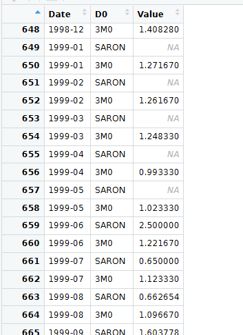
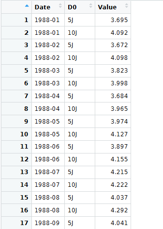
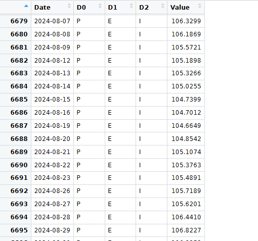

# Data Sources

This file documents all data sources and the structure of the data as of the current version. This is currently a work in progress.

## GDP Data

The GDP Data is downloaded from SECO under the following link: "<https://www.seco.admin.ch/dam/seco/de/dokumente/Wirtschaft/Wirtschaftslage/BIP_Daten/ch_seco_gdp_csv.csv.download.csv/ch_seco_gdp.csv>" and saved as gdp.csv

It contains a CSV Data with the following Column Names: `"...1" "structure" "type" "seas_adj" "date" "value"`

The script `01_load_data.R` downloads the data from the link and saves it. Then the script `02_format_data.R` selects the observations we need.

- `structure` = `gdp` Select full GDP and not a subset
- `type` = `real` Real GDP
- `seas_adj` = `cssa` Calendar, seasonally and sport event adjusted

The dataframe then looks like this:



Then the data is already adjusted, but needs to be detrended, which is done in scripts `03_transform_data.R`. This is done via the HP Filter and the `neverhpfillter` package. Further lags for t-1 and t-2 are created to prepare the final data.

## SPF Data

The SPF Data is downloaded via the `kofdata` Package using the `get_collection()` function. More information on the data can be found here: <https://kof.ethz.ch/en/surveys/experts-surveys/kof-consensus-forecast.html>, including download and methodology.

The Dataframe is then saved as kof_master.csv. It inclodes all consensus forecast mean values. From it we select:

- `ch.kof.consensus.q_qn_unemp_5y.mean` -\> The mean forecast of unemployment in 5 years
- `ch.kof.consensus.q_qn_prices_5y.mean` -\> The mean forecast of yearly CPI increase in 5 years
- `ch.kof.consensus.q_qn_3minterest_3m.mean`-\> The three month mean interest rate forecast of SARON
- `ch.kof.consensus.q_qn_3minterest_12m.mea` -\> The 12 month mean interest rate forecast
- `date`-\> the date column from the quarter the forecast was taken from.

This is how the master looks: 

The Unemployment forecast is not seasonally adjusted. We adjust it using the `seasonal` package. The step happens in the `format_time_series_df()` function.

## Employment Data

The Employment Data is downloaded via the BFS Package as well, using the `bfs_get_data()` function with id: px-x-0602000000_101.

The data looks like this: 

Then we filter for - `Division.économique`= `5-96 Total`(NOGA codes 5 to 96, which exclude sectors like agriculture) - `Taux.d.occupation` = `Equivalents plein temps, désaisonnalisé`(Full time equivalent, seas adj.) - `Sexe` = `Sexe - total` (All genders)

Excluding farm workers is the usual approach with (un) employment data as it's hard to accurately measure these sectors and the work is highly cyclical. We also filter for Full time equivalent and all genders.

## Unemployment Data

The unemployment is from the **Swiss Federal Office of Statistics** (BFS). It's downloaded via the `BFS`Package using `bfs_download_asset()` and saved as cpi_series.xlsx

The data looks like this: 

Then we select the data for `REGION`= `TOTAL` as this is the whole of Switzerland.

The Unemployment data is not seasonally adjusted. We adjust it using the `seasonal` package. The step happens in the `format_time_series_df()` function.

Finally we calculate the unemployment rate by dividing unemployment by (unemployment + employment).

## CPI Data

The CPI Data is from the **Swiss Federal Office of Statistics** (BFS) with ID: 36483229. It's downloaded via the `BFS`Package using `bfs_download_asset()` and saved as cpi_series.xlsx

The data looks like this: 

Then we select the data for column `38687` as it is indexed in 2015. In theory the index columns are interchangable, however numbers that are closer to 100 are more readable and optimizers work better when the data is all in similiar magnitude.

## SARON & LIBOR Data

Downloaded via the **Swiss National Bank** (SNB) API. More info available here: <https://data.snb.ch/en>

First The function `download_snb_data()` calls the API using a specific URL. The Url accesses a data storage cube on the site such as this: <https://data.snb.ch/en/topics/ziredev/cube/zimoma>.

If you visit a table online you will find an Info button for AI handling.

Apart from the Cube you select the dimensions, `D0`, `D1`, `D2`. You may not need all of them. Here the datacube is `zimoma` (Money Market Rates). We select `3M0` (LIBOR) and `SARON` from the `D0` dimension. We also specify the timeframe where we want the data via `from_date` and `to_date`.

The API call Downloads two datafiles a CSV with the actual data and the metadate as JSON file.

The data looks like this: 

The SARON and LIBOR was discontinued in January of 2022 after multiple scandals while SARON calculations only exist since June of 1999.

The SARON is the SWISS AVERAGE RATE OVERNIGHT and the primary refinancing rate in swiss francs. It's based on overnight lending between banks in francs. It gets calculated daily and then averaged out monthly. See more here: <https://www.six-group.com/en/market-data/indices/switzerland/saron.html>

The LIBOR was an average interest rate for borrowing between global banks. In contrast to the SARON it was calculated by asking banks at what price they would lend to each other. In contrast to the SARON it did not take the actual, but the stated values of banks and was therefore subject to collusion. See more: <https://www.investopedia.com/terms/l/libor.asp>

## Government Bonds Data

Downloaded via the **Swiss National Bank** (SNB) API. More info available here: <https://data.snb.ch/en>

First The function `download_snb_data()` calls the API using a specific URL. The Url accesses a data storage cube on the site such as this: <https://data.snb.ch/de/topics/ziredev/cube/rendoblim>.

If you visit a table online you will find an Info button for AI handling.

Apart from the Cube you select the dimensions, `D0`, `D1`, `D2`. You may not need all of them. Here the datacube is `rendoblim` (Renditen von Obligationen). We select `5J` (5 years) and `10J` (10 years) from the `D0` dimension. We also specify the timeframe where we want the data via `from_date` and `to_date`.

The API call Downloads two datafiles a CSV with the actual data and the metadate as JSON file.

The data looks like this: 

## Exchange Rate Index Data

Downloaded via the **Swiss National Bank** (SNB) API. More info available here: <https://data.snb.ch/en>

First The function `download_snb_data()` calls the API using a specific URL. The Url accesses a data storage cube on the site such as this: <https://data.snb.ch/en/topics/ziredev/cube/devwkieffid>.

If you visit a table online you will find an Info button for AI handling.

Apart from the Cube you select the dimensions, `D0`, `D1`, `D2`. You may not need all of them. Here the datacube is `devwkieffid` (Effective exchange rate indices ). We select the following from the dimensions - `D0` = `P` (Real & PPI Based) - `D1` = `E` (Euro Area) - `D2` = `I` (Index)

We also specify the timeframe where we want the data via `from_date` and `to_date`.

The API call Downloads two datafiles a CSV with the actual data and the metadata as JSON file.

The data looks like this: 

As the Data is daily, we summarize by monthy by sleecting the last value of every month.

Missing here are exchange rate for EUR and adn CHF

## EU PPI Data

Downloaded via the `eurostat` package with the id `sts_inppd_m`. From the Dataset, we select geographical location EA20, refering to the Euro Area. NACE2 Specification is code B-D. FInally I21 referes to the indexing date being 2021.
Link is this: https://ec.europa.eu/eurostat/databrowser/view/sts_inppd_m/default/table here maybe look at derived tiime series for other possibilities?

## Models and Data used in them

### Okun Model

This model uses GDP Data from the **Swiss State Secretariat for Economic Affairs** (SECO). The Unemployment Data comes from the **Swiss Federal Statistics Department** (BFS). The SPF Data comes from the ETH Zürichs **KOF Institute**.

### Phillips Model

This model uses GDP Data from the **Swiss State Secretariat for Economic Affairs** (SECO). The SPF Data comes from the ETH Zürichs **KOF Institute**. The CPI Data from the **Swiss Federal Statistics Department** (BFS).
FOr the REER CREA we use the SNB REER PPI based exchange rate from the SNB, the CHF/EUR Exchange rate from the SNB, REAL PPI Indices for switzerland from the BFS and Real PPI Based INdices from EUROSTAT

### Taylor Model
The interest rates used are both from the SNB. It's a spliced series between the LIBOR and SARON. We also get the 5y and 10y government bond data from the SNB to calculate the forward rate.
we get the GDP data from the SECO and the CPI data from the BFS.


```         
R version 4.3.3
```

# Contact

Jonas Bruno\
jonas.bruno\@unil.ch

Last Update 13.04.2026
